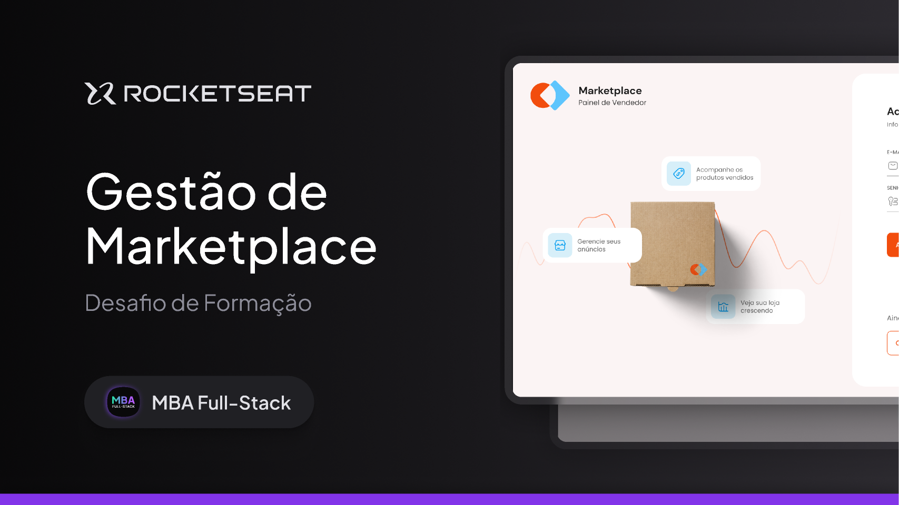

<div align="center">
  <h1>Marketplace Management - API</h1>
  <h2>MBA - FullStack</h2>
</div>

<hr/>

## Technologies

- NestJS
- TypeScript
- Prisma ORM
- JWT Auth
- File uploads
- Metrics and views
- Unit and end-to-end testing

### Extras

- Zod
- Vitest
- Docker



### How to run

```bash
# 1 - Clone the project and navigate into it
$ git clone https://github.com/juniorcintra/mba-marketplace-api-nestjs.git
$ cd mba-marketplace-api-nestjs

# 2 - Install the dependencies
$ npm install

# 3 - Start the services with Docker
$ docker compose up -d

# 4 - Run the database migrations
$ npx prisma migrate dev

# 5 - Start the application
$ npm run start:dev
```

The application will be available at: `http://localhost:3333`

### Tests

```bash
# Run unit tests
$ npm run test

# Run end-to-end tests
$ npm run test:e2e
```
